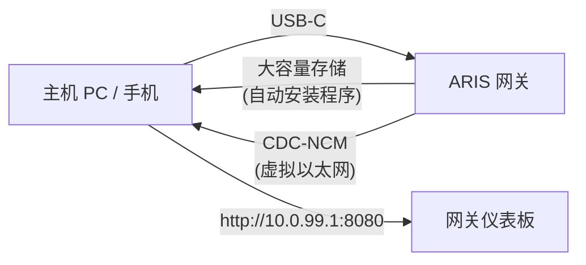

# USB-C 零配置预置

当 ARIS 通过 USB-C 连接到任何主机时，网关会呈现为一个具有两种功能的复合
USB 设备：

## 大容量存储

一个虚拟 USB 驱动器，包含针对各操作系统的 [evernight](https://github.com/celestia-island/evernight)
客户端自动安装程序：

- **Windows** — 带 AutoRun 的 `.bat` 安装程序
- **Linux** — `.sh` shell 脚本
- **macOS** — `.command` 文件
- **Android** — 屏幕指引

主机识别到 USB 驱动器，打开对应操作系统的安装程序，evernight 客户端即
完成安装，无需任何手动配置。

## CDC-NCM（虚拟以太网）

一个虚拟以太网适配器，为主机提供到网关仪表板 `http://10.0.99.1:8080` 的
直接 IP 链接。

## 流程

**插入 USB-C → 主机识别 USB 驱动器 → 打开安装程序 → 完成。**
无需网络配置、无需下载驱动程序、无需手动配对。
