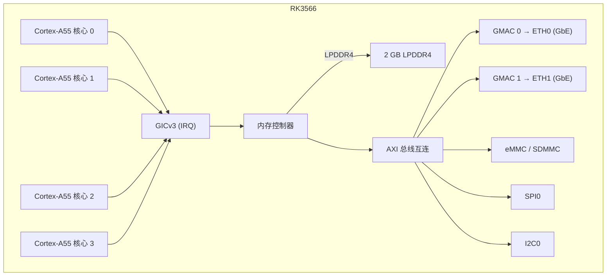

# NanoPi R3S — 硬件参考

## 规格

| 组件 | 详情 |
|-----------|--------|
| SoC | Rockchip RK3566 |
| CPU | 四核 Cortex-A55 @ 1.8 GHz |
| NPU | 1 TOPS (INT8) |
| RAM | 2 GB LPDDR4/LPDDR4X |
| 存储 | MicroSD（最高 128 GB）+ eMMC 模块 |
| 以太网 | 2x 10/100/1000 Mbps（RTL8211F PHY） |
| USB | 1x USB 3.0 Type-A |
| 调试 UART | 3 针 2.54mm 排针（3.3V TTL） |
| GPIO | 40 针 Raspberry Pi 兼容排针 |
| 电源 | 5V/3A，通过 USB-C |
| 尺寸 | 65 × 52 mm |

## 引脚定义

### 40 针 GPIO 排针

| 引脚 | 信号 | 引脚 | 信号 |
|-----|--------|-----|--------|
| 1 | 3.3V | 2 | 5V |
| 3 | GPIO2 | 4 | 5V |
| 5 | GPIO3 | 6 | GND |
| 7 | GPIO4 | 8 | GPIO14 (UART2 TX) |
| 9 | GND | 10 | GPIO15 (UART2 RX) |
| ... | ... | ... | ... |

### 调试 UART

| 引脚 | 标签 | 功能 |
|-----|-------|----------|
| 1 | GND | 接地 |
| 2 | TX  | UART2 TX (3.3V) |
| 3 | RX  | UART2 RX (3.3V) |

波特率：1500000，8 个数据位，无校验，1 个停止位。

## 框图（aris 固件）

