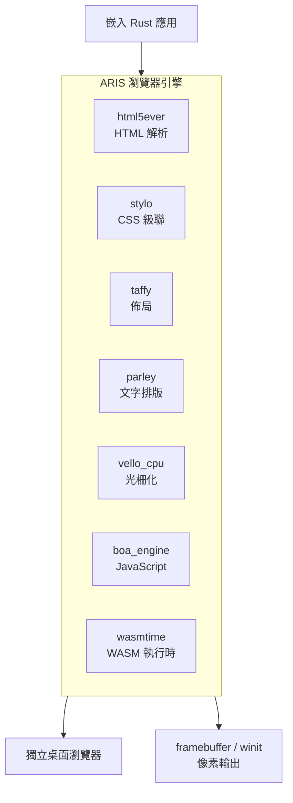

<p align="center"></p>

<h1 align="center">ARIS</h1>

<p align="center"><strong>基於 servo 構建的瀏覽器引擎——可嵌入、可獨立運行。底層設施已部分替換 servo 官方組件，改用純 Rust 替代方案。</strong></p>

<div align="center">

[](../../LICENSE)
[](https://github.com/celestia-island/aris/actions/workflows/ci.yml)

</div>

<div align="center">

[English](../en/README.md) ·
[简体中文](../zhs/README.md) ·
**繁體中文** ·
[日本語](../ja/README.md) ·
[한국어](../ko/README.md) ·
[Français](../fr/README.md) ·
[Español](../es/README.md) ·
[Русский](../ru/README.md) ·
[العربية](../ar/README.md)

</div>

## 簡介

ARIS 是一個**源自 servo 的瀏覽器引擎**。既可以作為函式庫嵌入任何 Rust 應用，也可以作為獨立桌面瀏覽器運行。渲染管線由純 Rust crate 組裝——html5ever、stylo、taffy、parley、vello——servo 原有的 SpiderMonkey / WebRender / SWGL 依賴已被 Boa（JS 引擎）、Vello CPU（光柵化）和 Wasmtime（WASM 執行時）替代。



## 為何不直接 fork Servo？

Servo 捆綁了 SpiderMonkey（C++）、WebRender（C++/SWGL）以及龐大的組件依賴圖。ARIS 取 servo 最精華的部分——純 Rust 實現的 HTML/CSS 前端（html5ever、stylo、cssparser、selectors）——並用純 Rust 方案重建 JavaScript、光柵化和 WASM 層。最終產物是一個更小、更簡潔、完全自包含的 Rust 程式碼庫。

| Servo 組件 | ARIS 替代方案 | 理由 |
|-----------|-------------|------|
| SpiderMonkey (C++) | boa_engine | 純 Rust，無需 C++ 構建 |
| WebRender + SWGL (C++) | vello_cpu | 純 Rust CPU 光柵化 |
| components/script | Boa 橋接層 | 無 SpiderMonkey 耦合 |
| — | wasmtime | WASM Component Model, WASI |

## 快速開始

```bash
# 構建獨立瀏覽器
cargo build -p aris-render --release

# 將網頁渲染到幀緩衝
cargo run -p aris-render --bin render_lagrange -- example.html

# 在桌面視窗中運行（winit 後端）
cargo run -p aris-render --bin render_window --features winit-backend
```

詳見[構建指南](./build/quickstart.md)。

## 架構

```
┌──────────────────────────────────────────────────────┐
│  tairitsu (VDOM) / hikari (UI 組件)                  │
│  WASM Component Model → WIT 介面                     │
├──────────────────────────────────────────────────────┤
│  ARIS 渲染管線                                        │
│  html5ever → stylo → taffy → parley → vello_cpu → RGBA│
│  Boa JS 引擎（頁面腳本）                               │
│  Wasmtime（WASM 組件, WASI）                          │
├──────────────────────────────────────────────────────┤
│  顯示後端: /dev/fb0 · winit+softbuffer                │
├──────────────────────────────────────────────────────┤
│  kei 核心（syscall ABI）或 Linux                       │
└──────────────────────────────────────────────────────┘
```

詳見[架構概覽](./architecture/overview.md)。

## 生態

- **[kei](https://github.com/celestia-island/kei)** — Rust 作業系統核心（syscall ABI、驅動）
- **[tairitsu](https://github.com/celestia-island/tairitsu)** — WASM UI 框架
- **[hikari](https://github.com/celestia-island/hikari)** — UI 組件庫
- **[shirabe](https://github.com/celestia-island/shirabe)** — 瀏覽器自動化，定義渲染 FFI 合約

## 授權條款

Business Source License 1.1 (BUSL-1.1)。2030-01-01 起轉換為 SySL-1.0 或 Apache-2.0。詳見 [LICENSE](../../LICENSE)。
