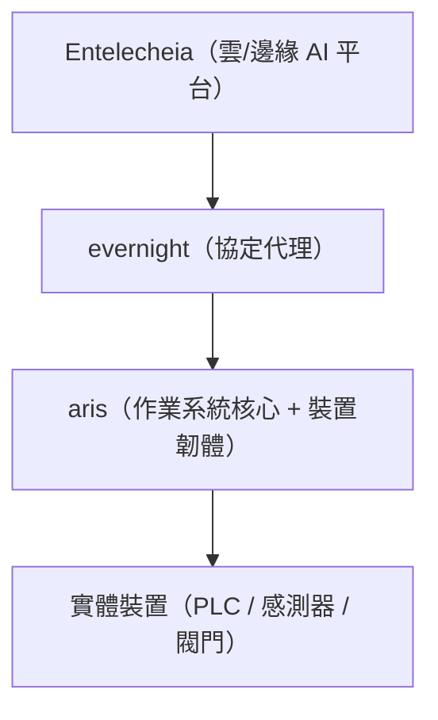

<p align="center"></p>

<h1 align="center">ARIS</h1>

<p align="center"><strong>面向工業物聯網閘道的嵌入式作業系統 — 在 ARM/RISC-V 邊緣裝置上執行 evernight</strong></p>

<div align="center">

[](../../LICENSE)
[](https://github.com/celestia-island/aris/actions/workflows/ci.yml)

</div>

<div align="center">

[English](../en/README.md) ·
[简体中文](../zhs/README.md) ·
**繁體中文** ·
[日本語](../ja/README.md) ·
[한국어](../ko/README.md) ·
[Français](../fr/README.md) ·
[Español](../es/README.md) ·
[Русский](../ru/README.md) ·
[العربية](../ar/README.md)

</div>

## 簡介

ARIS 是 Entelecheia 工業物聯網閘道的嵌入式作業系統/韌體。它在 ARM/RISC-V 邊緣裝置上執行
[evernight](https://github.com/celestia-island/evernight)，透過一個最小化、安全的核心層
將協定代理橋接到實體硬體。



## USB-C 零設定佈建

當透過 USB-C 連接到任意主機時，閘道將自身呈現為一個複合 USB 裝置：

- **大容量儲存** — 一個虛擬 USB 磁碟機，包含針對各作業系統的 evernight 客戶端自動安裝程式
  （Windows `.bat` + 自動執行、Linux `.sh`、macOS `.command`、Android 說明）
- **CDC-NCM** — 一個虛擬乙太網路介面卡，使主機獲得直連到閘道控制台的 IP 連結
  `http://10.0.99.1:8080`

**插入 USB-C → 主機識別為 USB 磁碟機 → 開啟安裝程式 → 完成。** 無需網路設定，
無需下載驅動，無需手動配對。

## 支援的架構

| 架構 | 狀態 | 目標開發板 |
|-------------|--------|---------------|
| ARMv8+ (aarch64) | 活躍 | NanoPi R3S (RK3566) |
| ARMv7+ (armv7) | 計畫中 | Raspberry Pi 3/4 |
| RISC-V 64 (riscv64) | 計畫中 | VisionFive 2 |
| x86_64 | 計畫中 | 工業電腦 |

## 快速開始

```bash
just setup-cross   # Install cross-compilation toolchains
just build         # Build firmware image for default board
just build-board nanopi-r3s
just flash-sd      # Write image to SD card
```

## 架構

ARIS 遵循兩階段策略：

- **第一階段**（目前）：Linux 核心 + Buildroot 風格的精簡根檔案系統，
  以常駐程序方式執行 evernight。務實可行，即刻交付。
- **第二階段**（未來）：[Asterinas](https://github.com/asterinas/asterinas)
  框架核心（Rust 作業系統）替換 Linux 核心。實現從晶片到頂層的完整安全堆疊。

請參閱[文件](./)以取得架構詳情、硬體參考和建置指南。

## 授權條款

Business Source License 1.1 (BUSL-1.1). Commercial use requires an
authorization license. Non-commercial use follows the SySL-1.0 protocol.
Converts to SySL-1.0 or Apache-2.0 on 2030-01-01. See [LICENSE](../../LICENSE).
