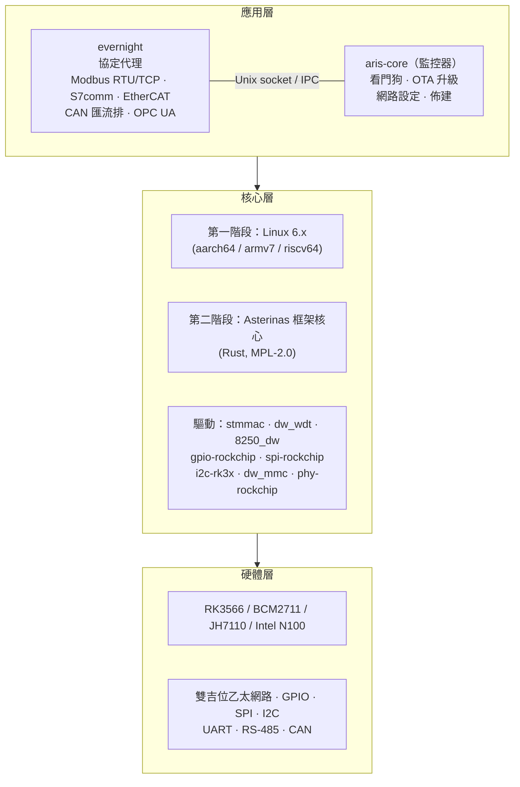
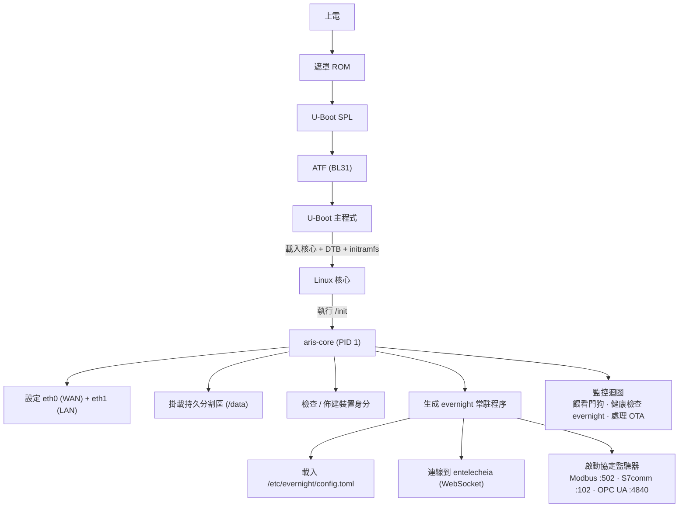
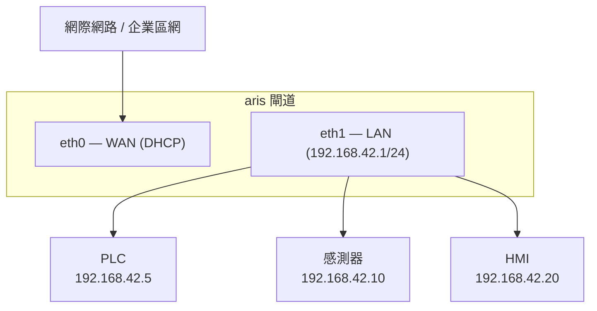

# aris 系統架構

## 概覽

aris 是面向工業物聯網閘道的模組化嵌入式作業系統，執行 Entelecheia 生態系統。
它透過一個最小化、安全的核心層，將 evernight 協定代理橋接到實體硬體。

## 架構分層

## 啟動流程

## 分割區佈局（A/B 更新）

| 偏移量 | 大小 | 分割區 | 內容 |
|--------|------|-----------|----------|
| 0 | 32 KiB | (間隙) | idbloader.img |
| 32 KiB | 8 MiB | (間隙) | u-boot.itb |
| 8 MiB | 128 MiB | boot-A | Image + DTB + boot.scr |
| 136 MiB | 128 MiB | boot-B | Image + DTB + boot.scr（備用） |
| 264 MiB | 512 MiB | rootfs-A | squashfs（唯讀） |
| 776 MiB | 512 MiB | rootfs-B | squashfs（唯讀，備用） |
| 1288 MiB | - | persistent | ext4（讀寫，/data） |

## 網路拓撲

## Asterinas ARM64 策略（第二階段）

ARM64 Asterinas 的主要上游來源：

- **Fork**：https://github.com/wanywhn/asterinas（分支：`arm64-support`）
- **PR**：asterinas/asterinas#3270
- **狀態**：幾乎已準備好合併；包含面向 aarch64 的 GICv3、ARM GIC、
  基本裝置樹、MMU 設定和 UART 控制台

一旦合併到 Asterinas 主線，aris 將追蹤官方儲存庫。在此之前，
`arm64-support` 分支作為開發基線。
