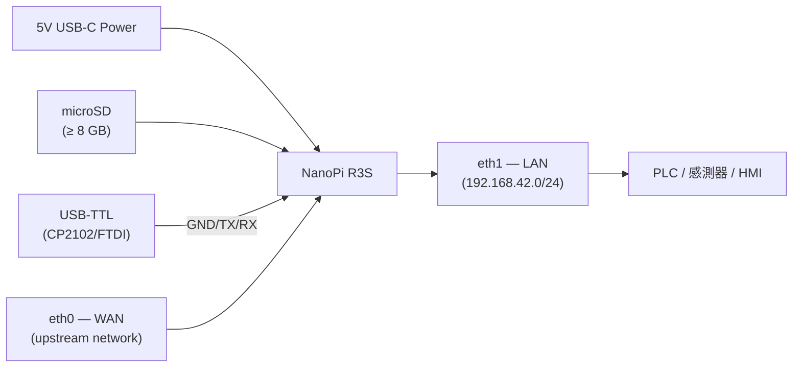
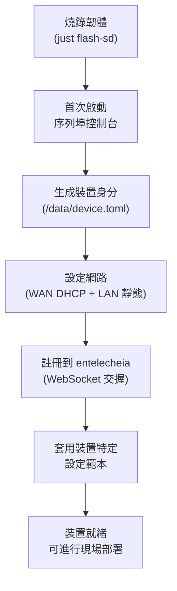
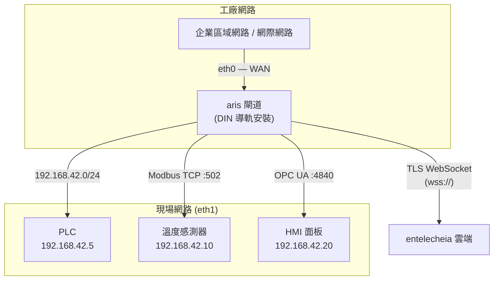
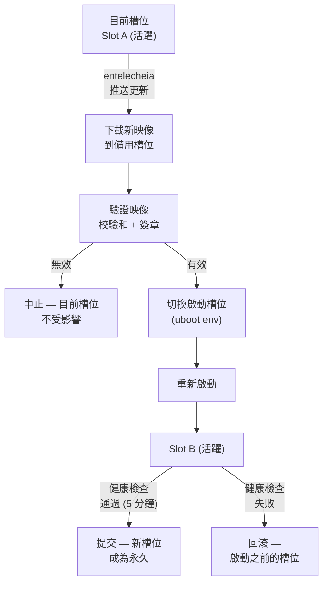

# aris 部署指南

## 概述

本指南涵蓋將 aris 韌體部署到實體硬體的全過程——從工廠預置到現場安裝和持續
維護。

## 硬體組裝

### NanoPi R3S

對於參考開發板（NanoPi R3S），您需要：

1. **NanoPi R3S 開發板**（RK3566，2GB RAM）
2. **microSD 卡**（≥ 8 GB，推薦 UHS-I）
3. **USB-C 電源供應器**（5V / 3A）
4. **USB-TTL 序列埠轉接器**（3.3V 邏輯電平，CP2102 或 FTDI）
5. **乙太網路線**（WAN + LAN 各一條）
6. **外殼**（可選，推薦 DIN 導軌安裝）



### 接線參考

| 開發板引腳 | USB-TTL 轉接器 | 備註 |
|-------------|-----------------|-------|
| Pin 1 (GND) | GND | 共地 |
| Pin 2 (TX) | RX | 開發板發送 → 轉接器接收 |
| Pin 3 (RX) | TX | 開發板接收 ← 轉接器發送 |

除錯序列埠鮑率為 **1500000 baud，8N1**。大多數終端機模擬器（`picocom`、
`minicom`、`screen`）支援此鮑率。

## 工廠預置

新裝置預置遵循以下步驟：



### 裝置身分

每台 aris 裝置都有儲存在 `/data/device.toml` 中的唯一身分：

```toml
[device]
node_id = "aris-nanopi-r3s-001"
hardware = "nanopi-r3s"
serial = "RK3566-SN-XXXXXXXX"

[entitlecheia]
endpoint = "wss://entelecheia.example.com/ws"
psk = "/data/keys/device.psk"
```

身分在首次啟動時生成並持久化到可寫持久分割區。預共享金鑰（`device.psk`）
用於與 entelecheia 的會話生命週期進行身分驗證。

## 網路拓撲

典型的現場部署如下：



- **eth0 (WAN)**：連接到上游企業網路或直接連接網際網路。預設使用 DHCP；
  可透過 `/data/network.toml` 設定靜態 IP。
- **eth1 (LAN)**：為本地現場匯流排網路提供服務，位址為 `192.168.42.0/24`。
  PLC、感測器和 HMI 在此連接。

## OTA 更新

aris 支援 A/B 雙槽位更新，實現安全、可回滾的韌體升級：



分割區佈局支援 `boot` 和 `rootfs` 的 A/B 雙份：

| 槽位 | boot 分割區 | rootfs 分割區 | 狀態 |
|------|---------------|-----------------|--------|
| A | `boot-A` (128 MiB) | `rootfs-A` (512 MiB) | 主 |
| B | `boot-B` (128 MiB) | `rootfs-B` (512 MiB) | 備用 |

## 現場部署檢查清單

將裝置部署到實體現場之前，請驗證：

1. **硬體**：所有線纜已插好，電源充足，外殼已密封
2. **儲存**：SD 卡已正確插入，未啟用寫入保護開關
3. **網路**：eth0 和 eth1 均已連接到正確的網路
4. **序列埠**：USB-TTL 可用以進行緊急控制台存取
5. **啟動**：上電，透過序列埠控制台監控啟動訊息
6. **服務**：`aris-core`（PID 1）和 `evernight` 守護程序正在執行
7. **註冊**：裝置出現在 entelecheia 儀表板中
8. **協定**：Modbus/S7comm/OPC UA 監聽器可從現場裝置存取
9. **OTA**：測試一個虛擬 OTA 更新以驗證分割區佈局
10. **看門狗**：透過終止 `aris-core` 測試看門狗 — 裝置應重新啟動

```bash
# Verify services on the device (via SSH or serial)
ps aux | grep aris-core
ps aux | grep evernight

# Check network interfaces
ip addr show eth0
ip addr show eth1

# Check partition layout
cat /proc/partitions

# Check boot slot
fw_printenv boot_slot

# Trigger manual health check
aris-core --health-check
```

## 監控

部署後，請監控以下指標：

| 指標 | 資料來源 | 警示閾值 |
|--------|--------|----------------|
| CPU 溫度 | `/sys/class/thermal/thermal_zone0/temp` | > 80°C |
| 記憶體使用率 | `/proc/meminfo` | > 90% |
| 儲存磨損 | `/data/wear_level.txt` | > 80% rated cycles |
| 網路鏈路 | `ethtool eth0` / `ethtool eth1` | Link down |
| evernight 狀態 | `systemctl status evernight` | Not running |
| entelecheia 連線 | `/var/log/evernight.log` | Disconnected > 60s |

所有指標透過 evernight 協定代理上報到 entelecheia。警示顯示在 entelecheia
儀表板中，並可觸發自動回應（重新啟動、容錯移轉、派遣技術人員）。
