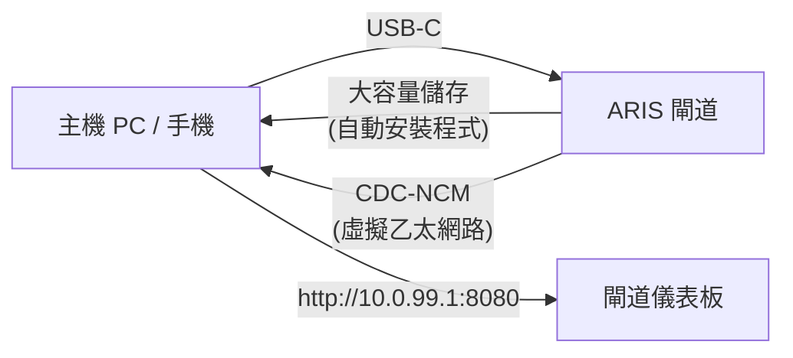

# USB-C 零設定預置

當 ARIS 透過 USB-C 連接到任何主機時，閘道會呈現為一個具有兩種功能的複合
USB 裝置：

## 大容量儲存

一個虛擬 USB 磁碟機，包含針對各作業系統的 [evernight](https://github.com/celestia-island/evernight)
用戶端自動安裝程式：

- **Windows** — 附 AutoRun 的 `.bat` 安裝程式
- **Linux** — `.sh` shell 指令碼
- **macOS** — `.command` 檔案
- **Android** — 螢幕指引

主機識別到 USB 磁碟機，開啟對應作業系統的安裝程式，evernight 用戶端即
完成安裝，無需任何手動設定。

## CDC-NCM（虛擬乙太網路）

一個虛擬乙太網路轉接器，為主機提供到閘道儀表板 `http://10.0.99.1:8080` 的
直接 IP 連結。

## 流程

**插入 USB-C → 主機識別 USB 磁碟機 → 開啟安裝程式 → 完成。**
無需網路設定、無需下載驅動程式、無需手動配對。
