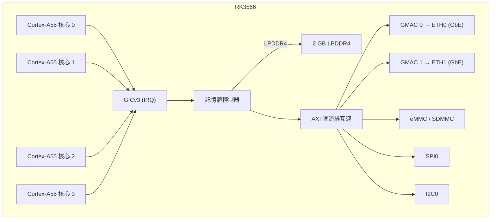

# NanoPi R3S — 硬體參考

## 規格

| 元件 | 詳情 |
|-----------|--------|
| SoC | Rockchip RK3566 |
| CPU | 四核 Cortex-A55 @ 1.8 GHz |
| NPU | 1 TOPS (INT8) |
| RAM | 2 GB LPDDR4/LPDDR4X |
| 儲存 | MicroSD（最高 128 GB）+ eMMC 模組 |
| 乙太網路 | 2x 10/100/1000 Mbps（RTL8211F PHY） |
| USB | 1x USB 3.0 Type-A |
| 除錯 UART | 3 針 2.54mm 排針（3.3V TTL） |
| GPIO | 40 針 Raspberry Pi 相容排針 |
| 電源 | 5V/3A，透過 USB-C |
| 尺寸 | 65 × 52 mm |

## 接腳定義

### 40 針 GPIO 排針

| 接腳 | 訊號 | 接腳 | 訊號 |
|-----|--------|-----|--------|
| 1 | 3.3V | 2 | 5V |
| 3 | GPIO2 | 4 | 5V |
| 5 | GPIO3 | 6 | GND |
| 7 | GPIO4 | 8 | GPIO14 (UART2 TX) |
| 9 | GND | 10 | GPIO15 (UART2 RX) |
| ... | ... | ... | ... |

### 除錯 UART

| 接腳 | 標籤 | 功能 |
|-----|-------|----------|
| 1 | GND | 接地 |
| 2 | TX  | UART2 TX (3.3V) |
| 3 | RX  | UART2 RX (3.3V) |

鮑率：1500000，8 個資料位元，無同位，1 個停止位元。

## 方塊圖（aris 韌體）

